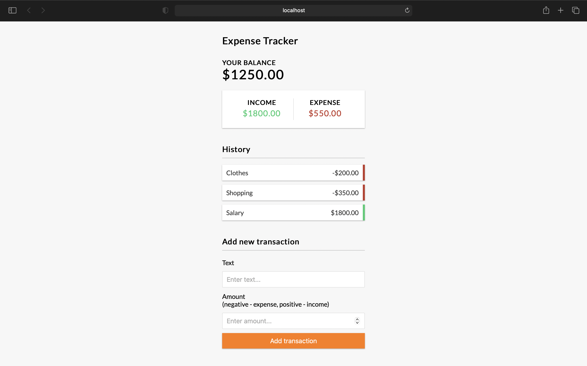

<p align="center">
  
</p>

## ✨ Technologies

This project was developed with the following technologies:

- [React](https://reactjs.org)
- [JavaScript](https://developer.mozilla.org/en-US/docs/Web/JavaScript)


## 💻 Project

Expense-Tracker is a calculator designed to keep track of your finances, where you can record your capital inflows and outflows. 💰


## ⚙️ Usage

- Clone the repository

```
# Install dependencies
npm install

# Watch CSS & run server on :3000
npm start

# Build CSS and assets
npm run build
```